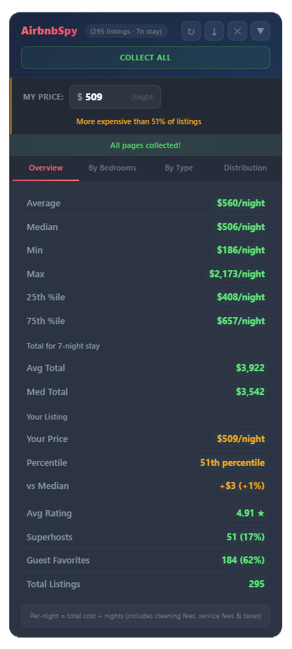

# AirbnbSpy - Pricing Analytics for Airbnb Hosts

A Tampermonkey userscript that analyzes Airbnb search results in real-time to help hosts optimize their nightly pricing. It scrapes listing data directly from the page, calculates per-night rates, and displays a floating analytics panel with competitive insights.

## What It Does

When you search on Airbnb with dates selected, AirbnbSpy automatically collects data from every listing on the page and calculates:

### Pricing Analytics
- **Average, Median, Min, Max** per-night rates across all visible listings
- **25th and 75th percentile** prices to understand the competitive range
- **Total stay costs** (average and median) for the selected date range

### Important: How Prices Are Calculated

Airbnb search results show **total stay prices** that include:
- Base nightly rate
- Cleaning fees
- Airbnb service fees
- Taxes

AirbnbSpy detects the number of nights from your search (e.g., a Jul 4-11 search = 7 nights) and divides the total by the number of nights to give you a **per-night all-in rate**. This is the true cost guests see when comparing listings, making it the most useful number for pricing decisions.

### "My Listing" Comparator

Enter your own nightly price to see exactly where you stand:
- **Percentile ranking** (e.g., "Cheaper than 62% of listings")
- **Difference vs. median** in dollars and percentage
- **Color-coded feedback** — green (competitively priced), orange (mid-range), red (premium)
- Your price is **highlighted on the distribution chart** so you can visually see your position
- Price is saved locally so you don't have to re-enter it each time

### Breakdown Views

| Tab | What It Shows |
|-----|--------------|
| **Overview** | All key stats, your listing comparison, ratings, superhost/guest favorite percentages |
| **By Bedrooms** | Average and median prices grouped by bedroom count (Studio, 1 BR, 2 BR, etc.) |
| **By Type** | Prices grouped by property type (Entire home, Private room, etc.) |
| **Distribution** | Visual histogram of price distribution with your price marked |

### Auto-Collect

Instead of manually scrolling through pages, click **Collect All** to automatically:
1. Scroll down each page to load all listings
2. Click "Next" to advance to the next page
3. Repeat until all pages are collected
4. Click **Stop** at any time to halt collection

This lets you gather data from hundreds of listings across dozens of pages with one click.

### CSV Export

Export all collected data to a CSV file for further analysis in Excel or Google Sheets. Columns include:
- Listing ID, Name, URL
- Price per night, Total price, Number of nights
- Bedrooms, Beds, Bathrooms
- Rating, Review count
- Superhost status, Guest Favorite status
- Property type

## Installation

1. Install the [Tampermonkey](https://www.tampermonkey.net/) browser extension
2. Open the Tampermonkey dashboard (click the extension icon > Dashboard)
3. Click the **+** tab to create a new script
4. Delete the template code and paste the entire contents of `airbnbspy.user.js`
5. Press **Ctrl+S** (or Cmd+S) to save
6. Navigate to [airbnb.com](https://www.airbnb.com) and search with dates selected

## How to Use It

1. **Search Airbnb with dates** — The script needs a date range to calculate per-night prices. Searches without dates will show total prices as-is.
2. **Review the panel** — It appears in the bottom-right corner and auto-populates as you browse.
3. **Enter your price** — Type your nightly rate in the "My Price" field to see your competitive position.
4. **Collect more data** — Click "Collect All" to auto-scroll and paginate through all search results.
5. **Explore the tabs** — Check "By Bedrooms" to compare against similar-sized listings.
6. **Export if needed** — Click the download icon to get a CSV of all collected data.

## Tips for Hosts

- **Search your own area** with the same dates and guest count your target guests would use
- **Filter by bedroom count** on Airbnb before collecting, so you're comparing apples-to-apples
- **The median is more useful than the average** — a few luxury listings can skew the average up
- **25th-75th percentile range** represents the "sweet spot" where most listings are priced
- **Run multiple searches** with different date ranges to see how seasonal pricing varies
- Remember these are **all-in rates** (including fees/taxes) — your base nightly rate on Airbnb will be lower than what's shown here

## Data Privacy

AirbnbSpy runs entirely in your browser. No data is sent to any server. All collected listing data stays in your browser's memory and is cleared when you close the tab or click the clear button. Your "My Price" setting is saved to localStorage on your machine only.
